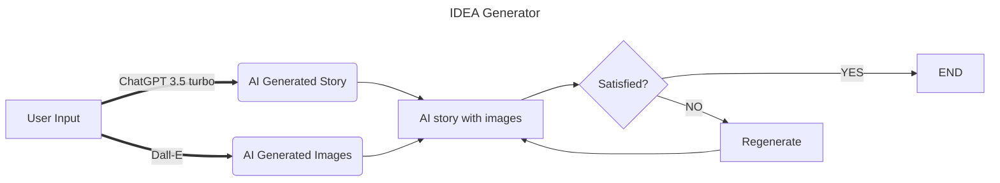

# CP3407 Group 1 Project 1
## IDEA Generator - Alpha Release

  

### Write's block happen to all of us, to minimized that, let IDEA Generator, an AI story and picture engine powered by OpenAI, be the source for your next inspiration!

#
## Flowchart

#
## Changelog:
* Version 1.1
    * Add home page, navigation and routers (using [react-router](https://reactrouter.com/en/main))
    * Add search bar to let user to search interested topic, then dynamically generate AI image and text 
    * __TODO__: Ask whether user is satisfied with result, for further operations
    
    
    #

* Version 1.0
    * React ([vite](https://vitejs.dev/)) frontend + [Express](https://expressjs.com/) backend
    * A **single page application**, aims to simply demonstrate results of AI image generator ([Dall-E](https://platform.openai.com/docs/api-reference/images/create)) combining with AI text generator ([Chatgpt 3.5 turbo](https://platform.openai.com/docs/api-reference/chat/create))
    * Replace [DeepAI](https://deepai.org/machine-learning-model/text2img) with Dall-E, as DeepAI requires membership and is more expensive.
    * __TODO__: Add search bar, navigation, more CSS

    * > Below is an example of AI generated content with topic: 'Batman vs Ironman'

      
      

