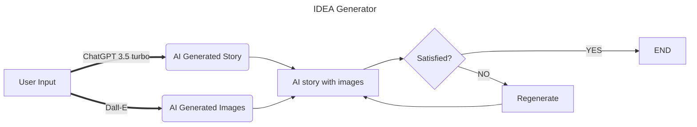

# CP3407 Group 1 Project 1
## IDEA Generator - Alpha Release

<p align="center">
  
</p>

### Writer's block happen to all of us, to minimized that, let IDEA Generator, an AI story and picture engine powered by OpenAI, be the source for your next inspiration!

## Flowchart

## How to use
### Online deployment
> *Although the end goal is to bring our application online, we may delay the plane due to budget control and other practical factors.*

### Local deployment

To use the application on your local computer, first clone repo :
```
git clone https://github.com/sihanchen01/cp3407.git
```
Change directory into app folder:
```
cd cp3407
```
Firstly, run `npm install` to install [concurrently](https://www.npmjs.com/package/concurrently) (at homefolder [package.json](./package.json)), which allow us to update or run both frontend and backend with a single command:
```
npm install
```
Then, to **install/update** both frontend and backend dependencies:
```
npm run getAll
```
Lastly, to **run** both frontend and backend applications:
```
npm run start
```
## Changelog:
* Version 1.1
    * Add home page, navigation and routers (using [react-router](https://reactrouter.com/en/main))
    * Add search bar to let user to search interested topic, then dynamically generate AI image and text 
    
    
    * __TODO__: 
        * Add function to gather user feedback on satisfaction of AI generated content, for further tuning
        * Online deployment.
    #

* Version 1.0
    * React ([vite](https://vitejs.dev/)) frontend + [Express](https://expressjs.com/) backend
    * A **single page application**, aims to simply demonstrate results of AI image generator ([Dall-E](https://platform.openai.com/docs/api-reference/images/create)) combining with AI text generator ([Chatgpt 3.5 turbo](https://platform.openai.com/docs/api-reference/chat/create))
    * Replace [DeepAI](https://deepai.org/machine-learning-model/text2img) with Dall-E, as DeepAI requires membership and is more expensive.
    * > An example of AI generated content with topic: 'Batman vs Ironman'

      
      
    * __TODO__: 
      * Add search bar
      * Navigation
      * More CSS


